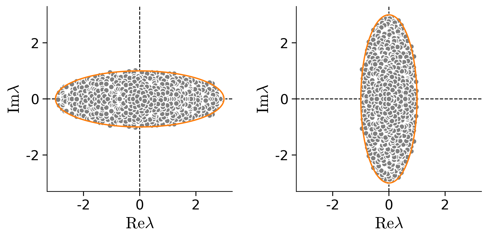
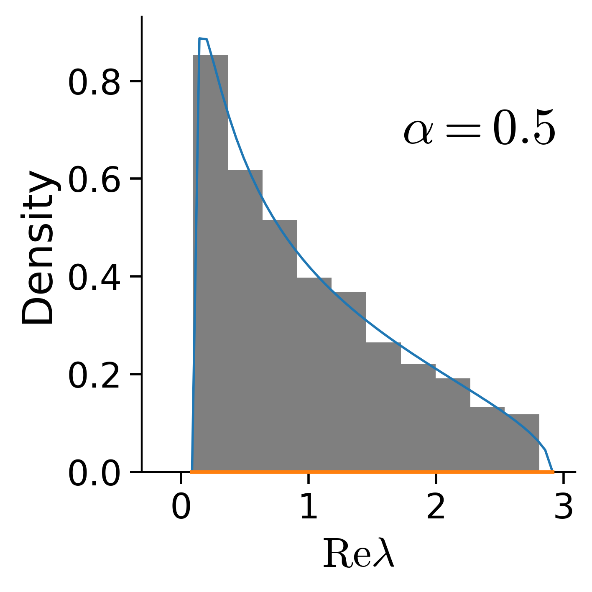
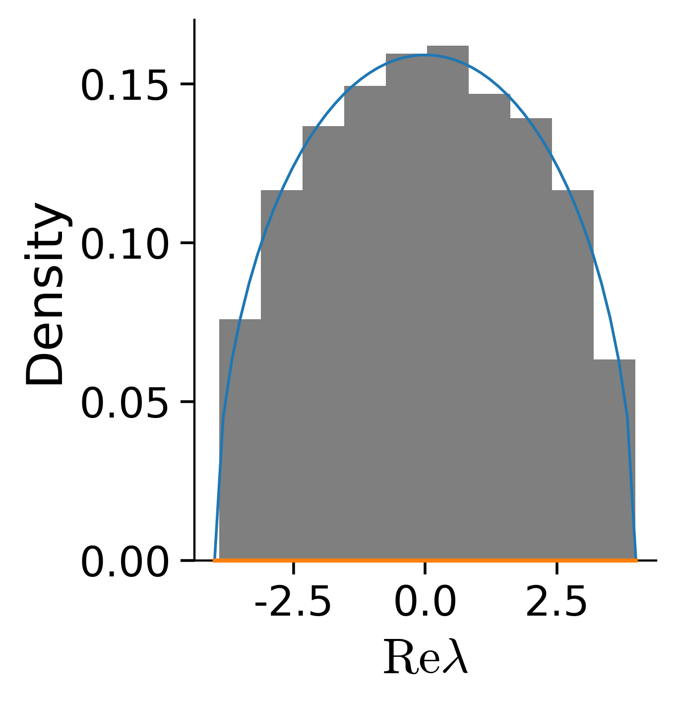

The random matrix gallery is a curated display of classes of random matrices where the eigenvalue spectrum is known. Each image in the gallery below links to a dedicated python notebook where you can vary the parameters and explore the effect on the resulting spectrum.

## Non-Hermitian matrices
Non-hermitian matrices have complex eigenvalues.

### Ginibre ensemble (Circular law)  
[[open notebook]  
](ensembles/Ginibre.ipynb)  
$$\mathrm{eigs}\left(X\right)\quad X\in\mathbb{R}^{N\times N}$$  
$$x_{ij}\sim\mathcal{N}\left(0, J^2/N\right)$$  
  
<code>Ginibre, J. (1965). Statistical ensembles of complex, quaternion, and real matrices. Journal of Mathematical Physics, 6(3), 440-449. [[paper]](https://doi.org/10.1063/1.1704292)</code>

### Ginibre ensemble with correlations (Elliptic law)  
[[open notebook]  
](ensembles/Elliptic.ipynb)  
$$\mathrm{eigs}\left(X\right)\quad X\in\mathbb{R}^{N\times N}$$  
$$\left(x_{ij}\atop x_{ji}\right)\sim\mathcal{N}\left(0, \left(1\quad\tau\atop \tau \quad1\right)J^2/N\right)$$  
  
<code>Sommers, H. J., Crisanti, A., Sompolinsky, H., & Stein, Y. (1988). Spectrum of large random asymmetric matrices. Physical review letters, 60(19), 1895. [[paper]](https://doi.org/10.1103/PhysRevLett.60.1895)</code>

### Non-Hermitian Wishart ensemble (paired Gaussian matrices with conjugate transpose)  
[[open notebook]  
](ensembles/nonHermitianWishart.ipynb)  
$$\mathrm{eigs}\left(XY^*\right)\quad X,Y\in\mathbb{C}^{N\times P},\ \alpha=P/N$$  
$$\left(x_{ij}\atop y_{ij}\right)\sim\mathcal{N}\left(0, \left(\sigma_x^2\quad\tau\sigma_x\sigma_y\atop \bar{\tau}\sigma_x\sigma_y \quad\sigma_y^2\right)/N\right)$$  
<code>Akemann, G., Byun, S. S., & Kang, N. G. (2021, April). A non-Hermitian generalisation of the Marchenko–Pastur distribution: from the circular law to multi-criticality. In Annales Henri Poincaré (Vol. 22, pp. 1035-1068). Springer International Publishing. [[paper]](https://doi.org/10.1007/s00023-020-00973-7)</code>

### Paired Gaussian matrices with pseudo-inverse
[[open notebook]  
](ensembles/pseudoInverse.ipynb)  
$$\mathrm{eigs}\left(XY^\dagger\right)\quad X,Y\in\mathbb{C}^{N\times P},\ \alpha=P/N$$  
$$\left(x_{ij}\atop y_{ij}\right)\sim\mathcal{N}\left(0, \left(\sigma_x^2\quad\tau\sigma_x\sigma_y\atop \bar{\tau}\sigma_x\sigma_y \quad\sigma_y^2\right)/N\right)$$  
<code>Cohen, U. (2025). Eigenvalue spectrum support of paired random matrices with pseudo-inverse. arXiv preprint arXiv:2506.21244. [[paper]](https://doi.org/10.48550/arXiv.2506.21244)</code>

### Other papers of interest
 * Ginibre ensemble with additive and multiplicative terms  
   <code>Ahmadian, Y., Fumarola, F., & Miller, K. D. (2015). Properties of networks with partially structured and partially random connectivity. Physical Review E, 91(1), 012820. [[paper]](https://doi.org/10.1103/PhysRevE.91.012820)</code>
 * Ginibre ensemble with generalized correlations  
   <code>Baron, J. W., Jewell, T. J., Ryder, C., & Galla, T. (2022). Eigenvalues of random matrices with generalized correlations: A path integral approach. Physical Review Letters, 128(12), 120601. [[paper]](https://doi.org/10.1103/PhysRevLett.128.120601)</code>
 * Products of rectangular matrices  
   <code>Burda, Z., Jarosz, A., Livan, G., Nowak, M. A., & Swiech, A. (2010). Eigenvalues and singular values of products of rectangular Gaussian random matrices. Physical Review E—Statistical, Nonlinear, and Soft Matter Physics, 82(6), 061114. [[paper]](https://doi.org/10.1103/PhysRevE.82.061114)</code>
 * Heavy tailed covariance matrices  
   <code>Belinschi, S., Dembo, A., & Guionnet, A. (2009). Spectral measure of heavy tailed band and covariance random matrices. Communications in Mathematical Physics, 289(3), 1023-1055. [[paper]](https://doi.org/10.1007/s00220-009-0822-4)</code>
   
 
## Hermitian matrices
Hermitian matrices have real eigenvalues.

### Wishart ensemble (Marchenko-Pastur law)  
[[open notebook]  
](ensembles/Wishart.ipynb)  
$$\mathrm{eigs}\left(X\right)\quad X\in\mathbb{R}^{P\times N},\ \alpha=P/N$$  
$$x_{ij}\sim\mathcal{N}\left(0, J^2/N\right)$$  
<code>Marchenko, V. A., & Pastur, L. A. (1967). Distribution of eigenvalues for some sets of random matrices. Mat. Sb.(NS), 72(114), 4. [[paper]](https://doi.org/10.1070/SM1967v001n04ABEH001994)</code>

### Gaussian Orthogonal Ensemble (Wigner semicircle law)  
[[open notebook]  
](ensembles/Wigner.ipynb)  
$$\mathrm{eigs}\left(X\right)\quad X\in\mathbb{R}^{N\times N}$$  
$$x_{i>j}\sim\mathcal{N}\left(0, J^2/N\right),\ x_{ji}=x_{ij}$$  
<code>Wigner, E. P. (1955). Characteristic Vectors of Bordered Matrices With Infinite Dimensions. Annals of Mathematics, 62(3), 548-564. [[paper]](https://doi.org/10.2307/1970079)</code>

### Other papers of interest
 * Lévy ensembles  
   <code>Burda, Z., Janik, R. A., Jurkiewicz, J., Nowak, M. A., Papp, G., & Zahed, I. (2002). Free random Lévy matrices. Physical Review E, 65(2), 021106. [[paper]](https://doi.org/10.1103/PhysRevE.65.021106)</code>
 * Wigner-Lévy ensembles  
   <code>Burda, Z., Jurkiewicz, J., Nowak, M. A., Papp, G., & Zahed, I. (2007). Free random lévy and wigner-lévy matrices. Physical Review E—Statistical, Nonlinear, and Soft Matter Physics, 75(5), 051126. [[paper]](https://doi.org/10.1103/PhysRevE.75.051126)</code>
 * Division of Gaussian and normalised RV  
   <code>Bohigas, O., de Carvalho, J. X., & Pato, M. P. (2008). Disordered ensembles of random matrices. Physical Review E—Statistical, Nonlinear, and Soft Matter Physics, 77(1), 011122. [[paper]](https://doi.org/10.1103/PhysRevE.77.011122)</code>
 * Extensive spike model  
   <code>Landau, I. D., Mel, G. C., & Ganguli, S. (2023). Singular vectors of sums of rectangular random matrices and optimal estimation of high-rank signals: The extensive spike model. Physical Review E, 108(5), 054129. [[paper]](https://doi.org/10.1103/PhysRevE.108.054129)</code>

## More information
The random matrix gallery is a curated display of classes of random matrices where the eigenvalue spectrum is known. It is probably biased by personal familiarity toward mathematical physics works, and is definitely biased when presenting works by the author.

 * Any feedback is most welcome!
   + Suggestions for missing ensembles are welcome. Please provide relevant code samples, similar to the examples in the available ensembles, to improve their chances to be included in the list.
   + If you found an error or you wish to contribue please contact population.codes (at gmail) or populationcodes (at github).
 * See setup.txt for setting up the environment if you wish to run the project locally.
 * All rights reserved to the author.
 * Created and curated by Uri Cohen [[personal website]](https://uricohen.github.io/).